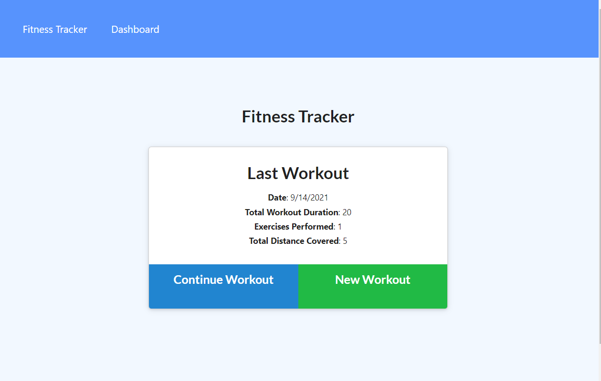

# 18-Nosql-Workout-Tracker

## User Story

* As a user, I want to be able to view create and track daily workouts. I want to be able to log multiple exercises in a workout on a given day. I should also be able to track the name, type, weight, sets, reps, and duration of exercise. If the exercise is a cardio exercise, I should be able to track my distance traveled.

## Tools

Using Mongoose, MongoDB, and express we build a database and load an application to allow a user to track workouts and store them to compare data.

## Functionality

Run 'npm i' then run 'npm start' to run the application.

## Example

A screenshot of the working application:

## Deployed

A link to the heroku application:

[Heroku](https://git.heroku.com/damp-escarpment-56922.git)
